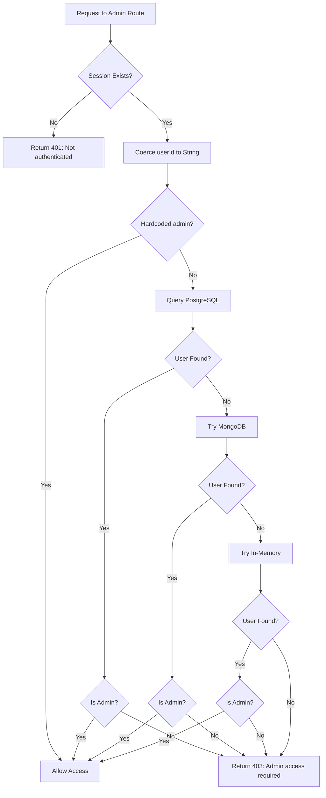

# Admin Authentication Fix Documentation

## Overview
This document describes the fixes applied to the admin authentication system to resolve session handling issues that caused 401 errors on authenticated admin routes.

## Problem Summary

### Issue 1: Type Mismatch in Session UserID
**Symptom:** GET `/api/admin/auth/me` returns 401 even with valid admin session

**Root Cause:** 
- Session stores `userId` as a string (UUID)
- Some code paths expected numeric comparison
- Database lookups failed due to type inconsistency

### Issue 2: Missing Logging
**Symptom:** Hard to debug authentication failures

**Root Cause:**
- No logging when authentication checks failed
- Silent failures made troubleshooting difficult

## Implemented Solutions

### 1. Consistent Type Coercion

**File:** `server/routes/admin/index.ts`

**Before:**
```typescript
async function requireAdmin(req: Request, res: Response, next: NextFunction) {
    if (!req.session.userId) {
        return res.status(401).json({ error: "Not authenticated" });
    }
    
    // Direct usage - type mismatch risk
    const user = await storage.getUser(req.session.userId);
    // ...
}
```

**After:**
```typescript
async function requireAdmin(req: Request, res: Response, next: NextFunction) {
    if (!req.session.userId) {
        console.log("[ADMIN_AUTH] No userId in session");
        return res.status(401).json({ error: "Not authenticated" });
    }
    
    // Coerce to string for consistent lookups
    const userId = String(req.session.userId);
    
    const user = await storage.getUser(userId);
    // ...
}
```

**Impact:**
- ✅ Handles both string and numeric session IDs
- ✅ Consistent type for all database lookups
- ✅ Works with UUID-based user IDs

### 2. Enhanced Logging

Added non-sensitive logging at key checkpoints:

```typescript
// Session check
console.log("[ADMIN_AUTH] No userId in session");

// Authorization check
console.log("[ADMIN_AUTH] User is not admin:", userId);

// User not found
console.log("[ADMIN_AUTH] User not found in any storage:", userId);

// MongoDB errors
console.error("[ADMIN_AUTH_MIDDLEWARE] MongoDB error:", err);

// General errors
console.error("[ADMIN_AUTH_MIDDLEWARE] Error:", error);
```

**Benefits:**
- Easy to trace authentication flow
- Identifies which storage backend was checked
- Shows where authentication fails
- No sensitive data (passwords, tokens) logged

### 3. Multi-Backend Support Maintained

The fix preserves the existing multi-storage architecture:

1. **PostgreSQL** (primary) - via `storage.getUser()`
2. **MongoDB** (fallback) - via `mongoStorage.getUser()`
3. **In-Memory** (development) - via `inMemoryUsers.find()`

Each backend is checked in sequence with proper error handling.

## Authentication Flow



## Files Modified

### 1. `server/routes/admin/index.ts`
- Updated `requireAdmin` middleware
- Added string coercion for `userId`
- Enhanced error logging

### 2. `server/routes/admin/auth.ts`
- Updated `/me` endpoint
- Added consistent type handling
- Improved error messages

## Testing the Fix

### 1. Verify Session Creation
```bash
# Login as admin
curl -X POST http://localhost:5000/api/admin/auth/login \
  -H "Content-Type: application/json" \
  -d '{"username": "admin", "password": "admin123"}' \
  -c cookies.txt

# Check response includes session cookie
```

### 2. Test /me Endpoint
```bash
# Should return admin user data
curl -X GET http://localhost:5000/api/admin/auth/me \
  -b cookies.txt

# Expected response:
{
  "id": "admin-uuid",
  "username": "admin",
  "email": "admin@odelads.com",
  "isAdmin": true,
  "status": "active"
}
```

### 3. Test Protected Route
```bash
# Should succeed with valid admin session
curl -X GET http://localhost:5000/api/admin/dashboard/stats \
  -b cookies.txt
```

### 4. Test Without Session
```bash
# Should return 401
curl -X GET http://localhost:5000/api/admin/auth/me

# Expected:
{ "error": "Not authenticated" }
```

### 5. Test Non-Admin User
```bash
# Login as regular user
curl -X POST http://localhost:5000/api/admin/auth/login \
  -H "Content-Type: application/json" \
  -d '{"username": "regular_user", "password": "password"}' \
  -c user_cookies.txt

# Try accessing admin route - should return 403
curl -X GET http://localhost:5000/api/admin/dashboard/stats \
  -b user_cookies.txt

# Expected:
{ "error": "Admin access required" }
```

## Session Configuration

### Required Environment Variables
```env
SESSION_SECRET=your-secure-random-string-here
NODE_ENV=production|development
```

### Session Settings
```typescript
app.use(session({
  secret: process.env.SESSION_SECRET,
  resave: false,
  saveUninitialized: false,
  cookie: {
    secure: process.env.NODE_ENV === 'production',
    httpOnly: true,
    maxAge: 24 * 60 * 60 * 1000, // 24 hours
    sameSite: 'lax',
    domain: undefined // Let browser handle
  }
}));
```

## Common Issues & Solutions

### Issue: Still getting 401 after login

**Possible Causes:**
1. Session cookie not being saved
2. Different domain/port between frontend and backend
3. CORS blocking credentials

**Solutions:**
```typescript
// Ensure fetch includes credentials
fetch('/api/admin/auth/me', {
  credentials: 'include'
});

// Check CORS settings
app.use(cors({
  origin: true,
  credentials: true
}));
```

### Issue: 403 instead of 401

**Meaning:** Session is valid but user lacks admin privileges

**Check:**
```sql
SELECT id, username, is_admin FROM users WHERE id = 'your-user-id';
```

**Fix:**
```sql
UPDATE users SET is_admin = true WHERE id = 'your-user-id';
```

### Issue: Logs show "User not found"

**Causes:**
1. User doesn't exist in any storage
2. Session `userId` doesn't match database `id`

**Debug:**
```typescript
// Add to middleware temporarily
console.log("[DEBUG] Session userId:", req.session.userId);
console.log("[DEBUG] Session data:", req.session);
```

## Security Considerations

### What's Logged
✅ Safe to log:
- User IDs (UUIDs)
- Usernames (no passwords)
- Authentication flow steps
- Error types

❌ Never log:
- Passwords
- Session secrets
- Full session objects
- Authorization tokens

### Production Settings

```typescript
// Use environment-specific logging
const isDev = process.env.NODE_ENV === 'development';

if (isDev) {
  console.log("[ADMIN_AUTH] User is not admin:", userId);
} else {
  console.log("[ADMIN_AUTH] Authorization failed");
}
```

## Monitoring

### Log Patterns to Watch

**Successful Auth:**
```
[ADMIN_AUTH_MIDDLEWARE] User authenticated: uuid-123
```

**Failed Auth:**
```
[ADMIN_AUTH] No userId in session
[ADMIN_AUTH] User not found in any storage: uuid-456
[ADMIN_AUTH] User is not admin: uuid-789
```

**Errors:**
```
[ADMIN_AUTH_MIDDLEWARE] Error: <error message>
[ADMIN_AUTH_MIDDLEWARE] MongoDB error: <mongo error>
```

## Performance Impact

- **Minimal:** String coercion is O(1)
- **Logging:** Only occurs on auth checks (not per-request)
- **Storage checks:** Already present, not added by fix

## Backward Compatibility

✅ Fully backward compatible:
- Existing sessions continue to work
- String and numeric IDs both supported
- No database migrations required
- No breaking changes to API

## Related Files

- `server/routes/admin/index.ts` - Middleware
- `server/routes/admin/auth.ts` - Auth endpoints
- `server/storage.ts` - Storage interface
- `server/db.ts` - Database connection
- `shared/models/auth.ts` - User schema

## Next Steps

1. Monitor logs for authentication patterns
2. Consider adding auth metrics
3. Review session timeout settings
4. Implement rate limiting on login endpoint

## References

- [Express Session Documentation](https://github.com/expressjs/session)
- [ADMIN_MANUAL_DEPOSIT_GUIDE.md](./ADMIN_MANUAL_DEPOSIT_GUIDE.md)
- [DATABASE_ARCHITECTURE.md](./DATABASE_ARCHITECTURE.md)
